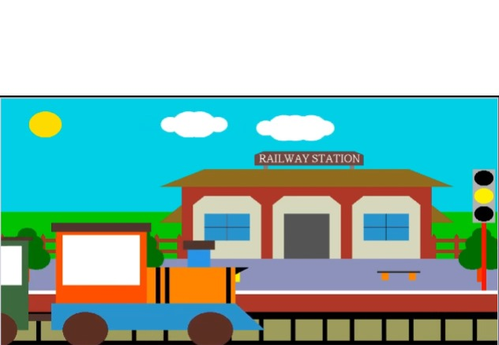
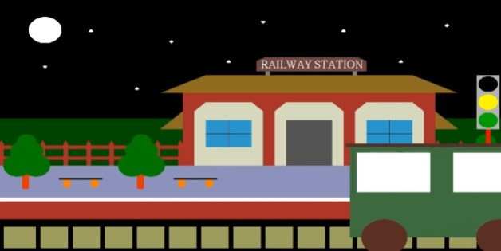
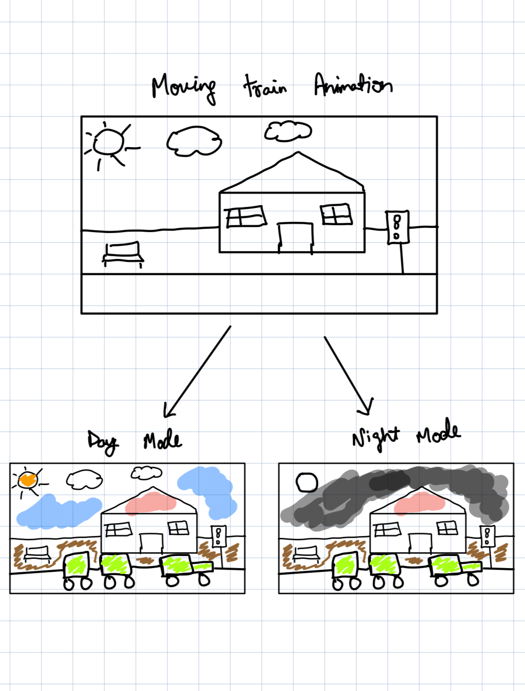
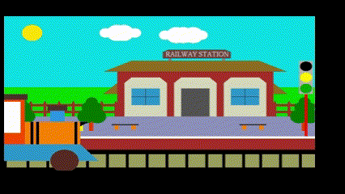

# Interactive Animated Graphic Sequence

This project aims to create an interactive/animated graphic sequence using HTML, CSS, and JavaScript. The animation involves a train moving across the screen, accompanied by a transition between day and night modes.

## Candidate Details
**Roll Number:** [102103449, 102103436]  
**Name:** [Aaryan Duggal, Jaideep singh]

## Description
The animation consists of a train moving horizontally across the screen. After each pass of the train, there's a transition between day and night modes, symbolizing the passage of time.

## Screenshots

### Day Mode

### Night Mode

## Storyboard

## Teaser

## Files Included
- `index.html`: HTML file containing the structure of the webpage.
- `style.css`: CSS file for styling the elements of the webpage.
- `main.js`: JavaScript file containing the logic for the train animation and day/night transition.
- `canvas-helpers.js`: JavaScript file providing helper functions for canvas operations.
- `domel.js`: JavaScript file handling the creation and manipulation of DOM elements.
- `experiment.js`: JavaScript file where the experiment class is defined, containing candidate details and main function calls.
- `steppers.js`: JavaScript file defining the `Stepper` class responsible for animating the train and managing day/night mode transitions.
- `clock.js`: JavaScript file for handling the clock animation (if needed).
